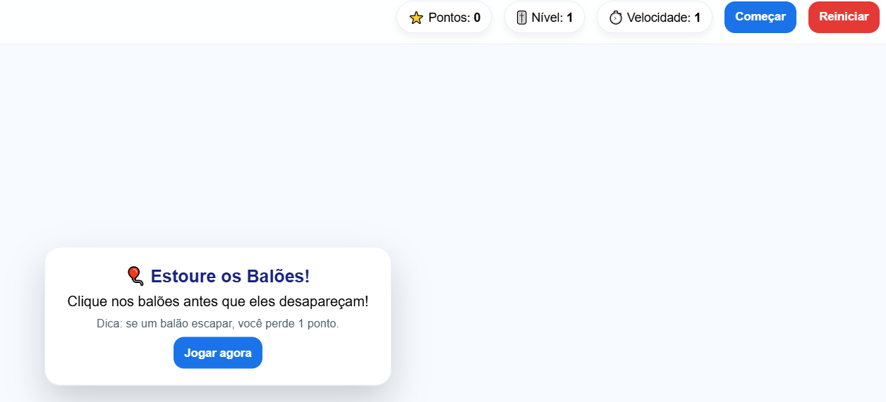

# 🎈 Estoure os Balões (Jogo Infantil em JavaScript)

Jogo simples para crianças: clique/toque nos balões antes que eles desapareçam.

## ✅ Como jogar
- Clique (ou toque) nos balões para marcar pontos
- Cada balão que “escapa” tira 1 ponto
- O nível aumenta conforme a pontuação

## 🚀 Rodando localmente
Basta abrir o `index.html` no navegador.

## 🌐 GitHub Pages
Depois de ativar o Pages, acesse pelo link que o GitHub gerar.

## 🧩 Tecnologias
- HTML
- CSS
- JavaScript (vanilla)

- ## 🎮 Preview do Jogo

👉 **[Clique aqui para jogar 🎈](https://annapatricia.github.io/jogo-baloes-js/)**

